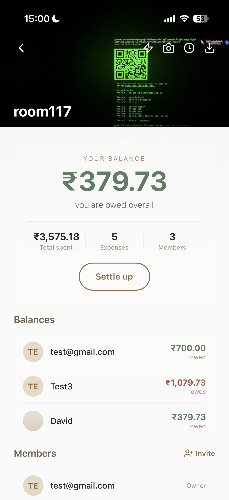
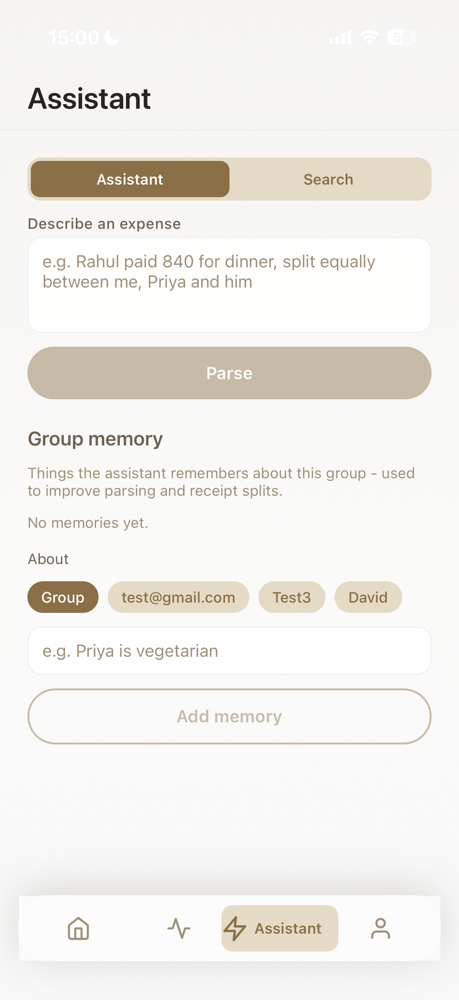
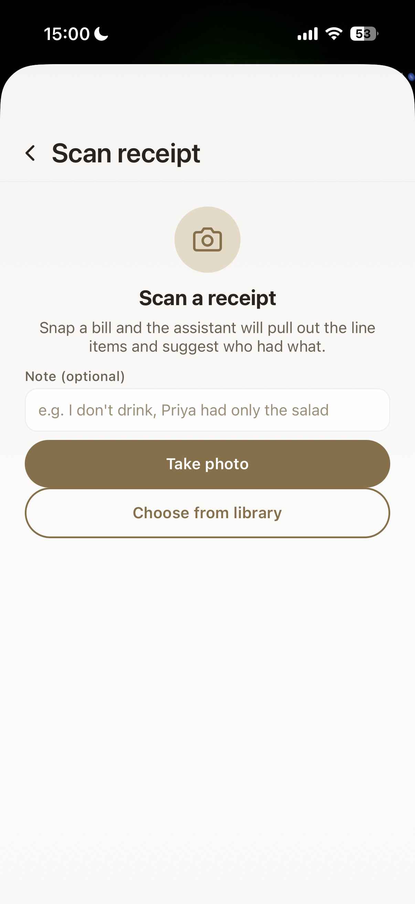
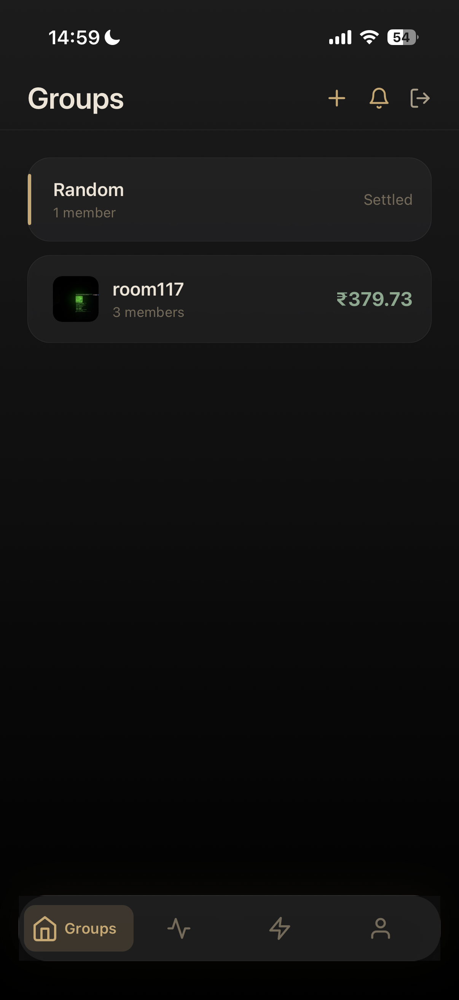
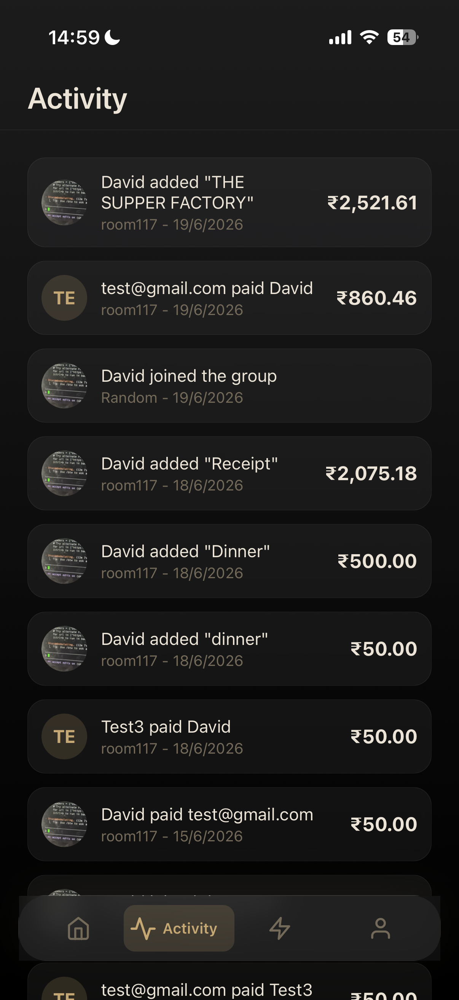
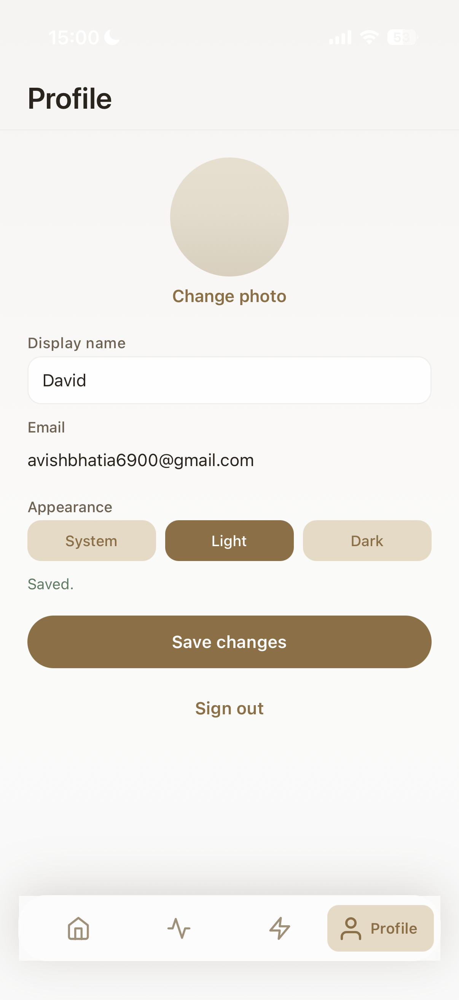

# SplitSmart

A mobile app for splitting shared expenses, with an AI layer for natural-language entry, receipt scanning, and group memory.


## Overview

SplitSmart tracks shared spending for a group of people. You create a group, record who paid for what, split each expense among the people involved, and settle up. Balances are computed from the underlying expenses and settlements every time you open a group, so they never drift out of sync. It is an Expo / React Native app backed by Supabase for auth, database, storage, and server logic.

It is built for the people who already keep a running tab with friends, flatmates, or travel groups, and who find manual entry the tedious part. The four standard split types are there, along with multiple payers per expense, third-party settlement recording, comments, and PDF export.

What separates it from tools like Splitwise is the AI layer. You can type an expense as a sentence and have it parsed into structured fields. You can photograph a restaurant bill and have the line items pulled out, assigned to people, and have tax distributed by each person's share rather than split evenly. The group also keeps a memory of facts you give it ("Priya is vegetarian"), which the parser and the receipt splitter read back when they make suggestions. These address the parts of expense splitting that the mainstream apps still leave as manual work.

## Screenshots

<table>
  <tr>
    <td align="center"><br/>Group detail with derived balances and a cover photo</td>
    <td align="center"><br/>AI assistant: natural-language entry and group memory</td>
    <td align="center"><br/>Receipt scanner</td>
  </tr>
  <tr>
    <td align="center"><br/>Group list in dark mode</td>
    <td align="center"><br/>Activity feed</td>
    <td align="center"><br/>Profile and appearance settings</td>
  </tr>
</table>

### Demos

<table>
  <tr>
    <td align="center" valign="top" width="25%"><video src="https://github.com/user-attachments/assets/706773f0-1187-4738-82a0-bfd581af14bf" width="200" controls muted></video></td>
    <td align="center" valign="top" width="25%"><video src="https://github.com/user-attachments/assets/63222433-8cd5-4440-b4f4-7fc260f10be0" width="200" controls muted></video></td>
    <td align="center" valign="top" width="25%"><video src="https://github.com/user-attachments/assets/3dc317fd-c9c1-425d-aa40-0b8cebfb1ded" width="200" controls muted></video></td>
    <td align="center" valign="top" width="25%"><video src="https://github.com/user-attachments/assets/6a93ab12-d995-47d5-9347-83e9a8bdb635" width="200" controls muted></video></td>
  </tr>
  <tr>
    <td align="center">App Overview</td>
    <td align="center">AI Assistant Parsing</td>
    <td align="center">Natural Language Expense Search</td>
    <td align="center">Smart Receipt Itemization</td>
  </tr>
</table>

## Features

### Core expense splitting

Groups hold members, who are added by email.

Each expense splits four ways: equal, exact amounts, percentages, or shares, with a live preview and validation before it saves.

An expense can be paid by several people at once, with each payer's contribution recorded and the largest contributor kept as the nominal payer.

Editing an expense rehydrates the original split exactly as it was entered; deleting one removes its participants by cascade.

Any member can record a settlement between any two members, prefilled from a greedy settle-up pass that suggests who should pay whom.

Balances are derived at read time from expenses, participant shares, and settlements, never stored.

Each expense has its own comment thread.

A group summary exports to PDF for sharing or record-keeping.

A group can carry a cover photo shown on its detail screen and as a thumbnail in the list.

### AI features

Typing an expense as a sentence parses it into a title, amount, payer, split type, and participants, ready to confirm.

Per-group memories record facts about the group and are read back to improve both parsing and receipt splits.

Expense search matches on meaning rather than exact wording.

Scanning a receipt photo extracts the line items, assigns them to people, and distributes tax in proportion to each person's pre-tax subtotal.

### Other

Light, dark, and system appearance modes, switchable from the profile screen.

Push notifications for group activity.

A three-screen onboarding shown once on first launch.

An activity feed that merges expenses, settlements, and member joins into one newest-first timeline.

## Tech Stack

| Technology | Purpose |
|------------|---------|
| Expo SDK 54 / React Native 0.81 | Mobile app for iOS, built with the New Architecture |
| TypeScript (strict) | Application language across app code and types |
| expo-router | File-based navigation with typed routes |
| Supabase Auth | Email and password sign-in, session persistence |
| Supabase Postgres | Primary database and the source of truth for schema |
| Supabase Storage | Avatar and group cover image storage |
| Supabase Edge Functions (Deno) | Server-side AI calls that run with the caller's auth context |
| PostgreSQL + pgvector | Vector storage and cosine-similarity search for memories and expenses |
| Gemini 2.5 Flash | Text parsing and receipt vision |
| text-embedding-004 | 768-dimension embeddings for retrieval and search |
| Row-Level Security | The access-control boundary for every table |

## AI Architecture

The AI features run in Supabase Edge Functions rather than on the client or a separate server. Each function receives the user's JWT, creates a Supabase client bound to that token, and makes its Gemini calls server-side. This keeps the Gemini API key out of the app, and it means every database read or write the function performs is still subject to the same Row-Level Security policies as the rest of the app. There is no separate backend to deploy or secure.

### Natural-language expense parsing

The assistant screen sends the typed sentence and the group id to the `parse-expense` function. The function loads the group's members, retrieves the most relevant group memories (see below), and assembles a system prompt that lists the members by name and includes those memories as context. It calls Gemini 2.5 Flash with a fixed JSON schema and gets back a structured object: title, total amount, the resolved payer, a split type, and the per-person participants. The client takes that object, prefills the expense form so the user can review and adjust it, and saves it through the transactional `save_expense` RPC. The model proposes; the database write still goes through the same validated path as a manually entered expense.

### Retrieval-augmented group memory

A memory is a short fact about a group, such as a dietary preference. When a memory is written, the `upsert-memory` function embeds its text with `text-embedding-004` into a 768-dimension vector and stores it in the `group_memories` table in a `pgvector` column. At parse or retrieval time, the query text is embedded the same way, and the `match_group_memories` RPC ranks stored memories by cosine similarity using pgvector's `<=>` distance operator over an HNSW index, returning the top five. Those memories are injected into the parsing prompt, so the model's suggestions reflect what the group has told it. The RPC runs `SECURITY INVOKER`, so a caller only ever retrieves memories for groups they belong to.

### Receipt scanning

The receipt screen encodes the photo as base64 and sends it to the `parse-receipt` function, which calls Gemini 2.5 Flash in vision mode. The model returns the restaurant name, the line items with amounts and categories, and a suggested assignment of items to the named members. The prompt instructs the model to distribute any tax, GST, VAT, or service charge in proportion to each diner's share of the pre-tax subtotal rather than splitting it evenly, so someone who only ordered food does not subsidise the bar tab. Back on the device, the user adjusts assignments and per-item split methods, the client computes each person's total in integer cents, and the result is saved as a single expense with itemized shares.

### Semantic expense search

The `search-expenses` function embeds the search text and calls the `match_expenses` RPC, which ranks a group's expenses by cosine similarity against a stored title embedding and returns the closest matches. This finds expenses by what they mean rather than by an exact string match.

## Architecture Overview

The app is layered so that responsibilities stay separate and the logic stays testable.

Screens contain UI only. They never touch the Supabase client directly; they call repository functions in `lib/repositories/`, which are thin wrappers that build a query, throw on error, and return typed rows. All money math lives in pure functions in `lib/balances.ts`, `lib/splits.ts`, and `lib/stats.ts`, with no I/O, so it can be reasoned about and unit-tested in isolation. Amounts are handled in integer cents to avoid floating-point drift, and split remainders are distributed deterministically so shares always sum exactly to the total.

Row-Level Security is the security boundary. Every table has RLS enabled, and the governing rule is that you can only see or change groups you belong to, enforced through `SECURITY DEFINER` helper functions such as `is_group_member()`. The application-side checks exist for clearer error messages, not for access control.

Balances are never stored. A member's net position is recomputed from the expenses they paid, their shares of all expenses, and the settlements they sent and received. Because nothing is cached, a balance can never disagree with the records it comes from.

Writing an expense touches two tables at once, so it goes through the transactional `save_expense` RPC. The function validates membership, that the payer and participants belong to the group, and that the shares reconcile to the total, then writes the expense and rewrites its split in one transaction. A bad split rolls back the whole write.

## Local Setup

A developer who has never seen this repo should be able to run it by following these steps.

1. Clone the repository.

   ```bash
   git clone <repository-url>
   cd splitsmart
   ```

2. Install the app's dependencies.

   ```bash
   cd apps/mobile
   npm install
   ```

3. Set up Supabase. The Supabase CLI commands run from the repo root, where the `supabase/` directory lives. A local stack needs Docker running.

   ```bash
   cd ..
   npx supabase start          # start the local Postgres + Auth stack
   npx supabase migration list # compare local and remote applied migrations
   npx supabase db reset       # rebuild the local database from the migrations
   ```

   To use a hosted project instead, link it with `npx supabase link` and apply the migrations with `npx supabase db push`.

4. Configure environment variables. Copy the example file if it is present, otherwise create `apps/mobile/.env` with your project's API URL and anon key (found under Project Settings, API in the Supabase dashboard, or printed by `npx supabase status` for the local stack).

   ```bash
   # apps/mobile/.env
   EXPO_PUBLIC_SUPABASE_URL=your-project-url
   EXPO_PUBLIC_SUPABASE_ANON_KEY=your-anon-key
   ```

   The Supabase client throws on startup if either value is missing.

5. Set the Gemini API key and deploy the Edge Functions. The key is read server-side by the functions through `Deno.env`, so it is set as a Supabase secret, not as an app env variable.

   ```bash
   npx supabase secrets set GEMINI_API_KEY=your-gemini-api-key
   npx supabase functions deploy
   ```

6. Run the app.

   ```bash
   cd apps/mobile
   npx expo start
   ```

   Press `i` for the iOS simulator, `a` for Android, or `w` for web.

## Database Schema

The schema is organized around groups and the people in them. `profiles` holds one row per user, created automatically on signup and linked one-to-one to the auth user. `groups` and `group_members` define each group and its membership and roles. `expenses` records what was spent, with `expense_participants` holding each person's resolved share (the source of truth) alongside the raw input that produced it, and `expense_payers` recording per-payer contributions when an expense had more than one payer. `settlements` records real transfers between two members, with a separate field for who logged the transfer. `expense_comments` holds the per-expense discussion. On the AI side, `group_memories` and `expenses.title_embedding` store pgvector embeddings for retrieval and search, while `expense_items` and `item_shares` hold scanned receipt line items and their per-person splits. Every table has Row-Level Security enabled, and the policies scope access through group membership.

## Footer

Built by Jugraj Singh Bhatia.

GitHub: https://github.com/AvisH420
